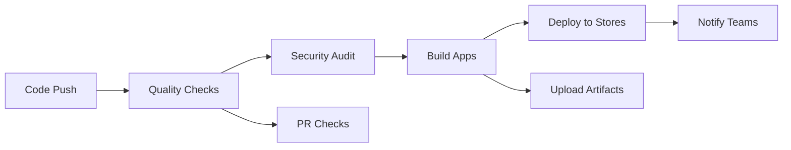

# 🚀 Phi-4 Reasoning App Deployment Guide

This guide covers the complete CI/CD pipeline and deployment process for the Phi-4 Reasoning React Native application.

## 📋 Table of Contents

1. [Prerequisites](#prerequisites)
2. [Environment Setup](#environment-setup)
3. [CI/CD Pipeline](#cicd-pipeline)
4. [GitHub Actions Workflows](#github-actions-workflows)
5. [Manual Deployment](#manual-deployment)
6. [Store Configuration](#store-configuration)
7. [Monitoring & Analytics](#monitoring--analytics)
8. [Troubleshooting](#troubleshooting)

## 🔧 Prerequisites

### Development Tools
- **Node.js 20+** and **Bun 1.1.0+**
- **Expo CLI** (`bun install -g @expo/cli`)
- **Git** with proper SSH/HTTPS access
- **Fastlane** for automated deployments

### Platform-Specific Requirements

#### iOS Development (macOS only)
- **Xcode 15+** with latest command line tools
- **CocoaPods** (`sudo gem install cocoapods`)
- **iOS Developer Account** ($99/year)
- **Apple Certificates & Provisioning Profiles**

#### Android Development
- **Android Studio** with SDK 34+
- **Java JDK 17**
- **Google Play Console Account** ($25 one-time)
- **Android Keystore** for signing

### Third-Party Services
- **GitHub** repository with Actions enabled
- **Expo Account** for OTA updates
- **Slack/Discord** for notifications (optional)
- **Codecov** for test coverage (optional)

## 🌍 Environment Setup

### 1. Clone and Setup Repository

```bash
git clone https://github.com/your-org/phi4-reasoning-app.git
cd phi4-reasoning-app

# Run setup script
chmod +x scripts/setup-env.sh
./scripts/setup-env.sh
```

### 2. Environment Variables

Create environment files for each stage:

```bash
# Development
cp .env.example .env.development

# Staging  
cp .env.example .env.staging

# Production
cp .env.example .env.production
```

#### Required Environment Variables

```bash
# App Configuration
EXPO_PUBLIC_ENVIRONMENT=production
EXPO_PUBLIC_APP_NAME="Phi-4 Reasoning"
EXPO_PUBLIC_APP_VERSION=1.0.0

# API Keys (Provided by Vibecode)
EXPO_PUBLIC_VIBECODE_OPENAI_API_KEY=sk-xxx
EXPO_PUBLIC_VIBECODE_ANTHROPIC_API_KEY=sk-ant-xxx
EXPO_PUBLIC_VIBECODE_GROK_API_KEY=gsk-xxx

# Feature Flags
EXPO_PUBLIC_ENABLE_ANALYTICS=true
EXPO_PUBLIC_ENABLE_CRASH_REPORTING=true
EXPO_PUBLIC_DEBUG_MODE=false

# Performance Settings
EXPO_PUBLIC_MAX_TOKENS=512
EXPO_PUBLIC_CONTEXT_LENGTH=128000
EXPO_PUBLIC_QUANTIZATION=INT4
```

### 3. GitHub Repository Secrets

Add these secrets to your GitHub repository (`Settings > Secrets and variables > Actions`):

#### General Secrets
```
EXPO_TOKEN=xxx                           # Expo authentication token
EXPO_PUBLIC_VIBECODE_OPENAI_API_KEY=xxx  # OpenAI API key
EXPO_PUBLIC_VIBECODE_ANTHROPIC_API_KEY=xxx # Anthropic API key  
EXPO_PUBLIC_VIBECODE_GROK_API_KEY=xxx    # Grok API key
```

#### iOS Secrets
```
IOS_DISTRIBUTION_CERTIFICATE=xxx         # Base64 encoded P12 certificate
IOS_CERTIFICATE_PASSWORD=xxx             # P12 certificate password
APPSTORE_ISSUER_ID=xxx                   # App Store Connect API issuer ID
APPSTORE_KEY_ID=xxx                      # App Store Connect API key ID
APPSTORE_PRIVATE_KEY=xxx                 # App Store Connect API private key
```

#### Android Secrets
```
ANDROID_SIGNING_KEY=xxx                  # Base64 encoded keystore
ANDROID_ALIAS=xxx                        # Keystore alias
ANDROID_KEY_STORE_PASSWORD=xxx           # Keystore password
ANDROID_KEY_PASSWORD=xxx                 # Key password
GOOGLE_PLAY_SERVICE_ACCOUNT=xxx          # Google Play service account JSON
```

#### Notification Secrets (Optional)
```
SLACK_WEBHOOK=xxx                        # Slack webhook URL
DISCORD_WEBHOOK=xxx                      # Discord webhook URL
SNYK_TOKEN=xxx                          # Snyk security scanning token
```

## 🔄 CI/CD Pipeline

The deployment pipeline consists of multiple GitHub Actions workflows:

### Pipeline Overview



### Workflow Files

1. **`.github/workflows/ci.yml`** - Main CI/CD pipeline
2. **`.github/workflows/pull-request.yml`** - PR validation
3. **`.github/workflows/release.yml`** - Release automation

### Trigger Events

| Workflow | Triggers | Purpose |
|----------|----------|---------|
| CI/CD | Push to `main`/`develop`, Releases | Full build and deployment |
| PR Checks | Pull requests | Code quality validation |
| Release | Git tags (`v*`) | Automated store deployment |

## 🤖 GitHub Actions Workflows

### Main CI/CD Pipeline (`ci.yml`)

#### Jobs Overview
1. **quality-check** - TypeScript, ESLint, Prettier, Tests
2. **security-audit** - Dependency audit, Snyk scan
3. **build-android** - Android APK/AAB creation
4. **build-ios** - iOS IPA creation  
5. **deploy-expo** - Expo OTA updates
6. **deploy-android** - Google Play deployment
7. **deploy-ios** - App Store deployment
8. **notify** - Team notifications

#### Build Matrix
- **Environments**: development, staging, production
- **Platforms**: Android, iOS
- **Build Types**: Debug, Release

### Pull Request Workflow (`pull-request.yml`)

#### Validation Steps
- ✅ TypeScript compilation
- ✅ ESLint linting
- ✅ Prettier formatting
- ✅ Unit test execution
- ✅ Test coverage reporting
- ✅ Bundle size analysis
- ✅ Security scanning

### Release Workflow (`release.yml`)

#### Automated Release Process
1. **Tag Creation** - `git tag v1.2.3`
2. **GitHub Release** - Automated changelog
3. **Asset Building** - APK, AAB, IPA
4. **Store Deployment** - Google Play, App Store
5. **Team Notification** - Slack, Discord

## 📱 Manual Deployment

### Quick Deployment Commands

```bash
# Setup environment (run once)
./scripts/setup-env.sh

# Build for production
./scripts/deploy.sh build-android production
./scripts/deploy.sh build-ios production

# Deploy to stores
./scripts/deploy.sh deploy-android production
./scripts/deploy.sh deploy-ios production

# Create release
./scripts/deploy.sh release 1.2.3
```

### Platform-Specific Deployment

#### Android Deployment

```bash
# Build AAB for Play Store
cd android
./gradlew bundleRelease

# Build APK for direct distribution
./gradlew assembleRelease

# Sign builds (done automatically in CI)
# Upload to Play Store via fastlane
fastlane android release
```

#### iOS Deployment

```bash
# Prebuild iOS project
bun run expo prebuild --platform ios --clean

# Install dependencies
cd ios && pod install

# Build and archive
xcodebuild -workspace Phi4Reasoning.xcworkspace \
  -scheme Phi4Reasoning \
  -configuration Release \
  -archivePath build/Phi4Reasoning.xcarchive \
  archive

# Export IPA
xcodebuild -exportArchive \
  -archivePath build/Phi4Reasoning.xcarchive \
  -exportPath build/

# Upload to App Store via fastlane
fastlane ios release
```

## 🏪 Store Configuration

### Google Play Console Setup

1. **Create App Listing**
   - App name: "Phi-4 Reasoning"
   - Package name: `com.vibecode.phi4reasoning`
   - Category: Education/Productivity

2. **App Content**
   - Privacy Policy URL
   - App screenshots (5+ per device type)
   - Feature graphic (1024x500)
   - App icon (512x512)

3. **Release Management**
   - Production track for releases
   - Internal/Beta track for testing
   - Staged rollout configuration

### Apple App Store Connect Setup

1. **App Information**
   - Bundle ID: `com.vibecode.phi4reasoning`
   - App Name: "Phi-4 Reasoning"
   - Category: Education/Productivity

2. **App Store Information**
   - Screenshots (multiple device sizes)
   - App preview videos
   - App description and keywords
   - Privacy policy and support URLs

3. **TestFlight**
   - Beta testing configuration
   - External tester groups
   - Build distribution

## 📊 Monitoring & Analytics

### Build Monitoring
- **GitHub Actions** dashboard for build status
- **Codecov** for test coverage tracking
- **Bundle size** tracking in PR comments

### Performance Monitoring
- **Expo Analytics** for app usage
- **Crash reporting** via Expo or third-party
- **Performance metrics** from app stores

### Security Monitoring
- **Snyk** for vulnerability scanning
- **Dependency audit** in CI pipeline
- **Secret scanning** with TruffleHog

## 🐛 Troubleshooting

### Common CI/CD Issues

#### Build Failures
```bash
# Clean and retry build
bun run clean
rm -rf node_modules
bun install
```

#### Certificate Issues (iOS)
- Verify certificate expiration dates
- Check provisioning profile validity
- Ensure correct team ID and bundle ID

#### Keystore Issues (Android)
- Verify keystore path and passwords
- Check alias configuration
- Ensure consistent signing across builds

### Environment Issues

#### Missing Environment Variables
```bash
# Check all required vars are set
./scripts/setup-env.sh

# Verify GitHub secrets are configured
gh secret list
```

#### Permission Issues
```bash
# Fix script permissions
chmod +x scripts/*.sh

# Fix Git hooks
chmod +x .git/hooks/*
```

### Platform-Specific Issues

#### iOS Build Issues
- Update Xcode to latest version
- Clear DerivedData: `rm -rf ~/Library/Developer/Xcode/DerivedData`
- Reset CocoaPods: `cd ios && pod deintegrate && pod install`

#### Android Build Issues
- Clear Gradle cache: `cd android && ./gradlew clean`
- Update Android SDK components
- Check Java version compatibility

## 🚀 Deployment Checklist

### Pre-Release
- [ ] All tests passing
- [ ] Code reviewed and approved
- [ ] Version number updated
- [ ] Changelog updated
- [ ] Environment variables configured
- [ ] Store assets prepared

### Release
- [ ] Create release tag
- [ ] Monitor build progress
- [ ] Verify app store uploads
- [ ] Test deployed builds
- [ ] Update documentation

### Post-Release
- [ ] Monitor crash reports
- [ ] Check app store metrics
- [ ] Notify stakeholders
- [ ] Plan next release

---

## 📞 Support & Contact

For deployment issues or questions:
- Create GitHub issues for bugs
- Check Actions logs for build failures
- Review store console for app-specific issues
- Contact team leads for access/permission issues

**Happy Deploying! 🎉**