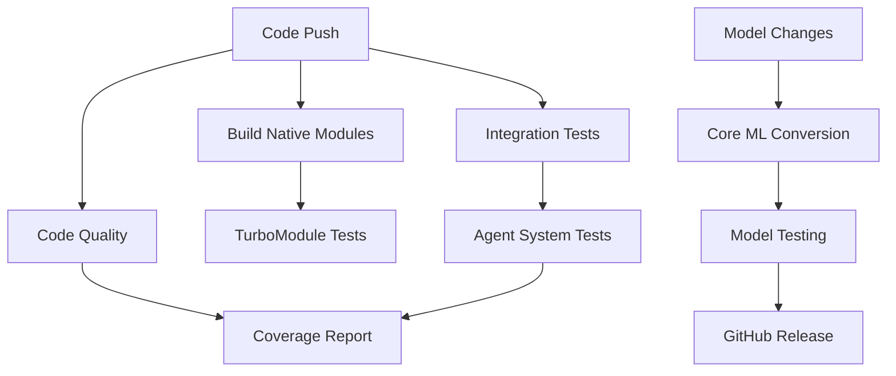

# GitHub Actions CI/CD Pipeline for Native LLM & TurboModules

## 📁 Structure
```
.github/
└── workflows/
    ├── build-native-modules.yml      # Native iOS/Android builds
    ├── convert-coreml-models.yml     # Phi-4 to Core ML conversion
    ├── test-integration.yml          # Integration & performance tests
    ├── ci.yml                        # Existing CI/CD pipeline
    ├── pull-request.yml             # PR checks
    └── release.yml                  # Release automation
```

## 🚀 Available Workflows

### 1. **Native Module Building** (`build-native-modules.yml`)
**Triggers:** Push to main/develop, PR changes to native code
**Purpose:** Build and test iOS/Android native modules and TurboModules

**Stages:**
- ✅ **Validate TurboModule Specs** - TypeScript compilation of specs
- 🍎 **iOS Native Build** - Xcode compilation with CocoaPods
- 🤖 **Android Native Build** - Gradle compilation and testing  
- 🧪 **TurboModule Integration Tests** - End-to-end native bridge testing

**Artifacts:** iOS/Android build outputs, test reports

### 2. **Core ML Model Conversion** (`convert-coreml-models.yml`)
**Triggers:** Manual dispatch, push to main, model changes
**Purpose:** Convert Phi-4 models to optimized Core ML format

**Features:**
- 🧠 **Multiple Model Variants**: Phi-4-mini-reasoning, Québécois fine-tuned
- ⚡ **Quantization Options**: INT4, INT8, None
- 🎯 **Compute Units**: Neural Engine, GPU, CPU optimization
- 🧪 **Model Validation**: Automated inference testing
- 📦 **GitHub Releases**: Automatic model distribution

**Matrix Strategy:**
```yaml
model: [phi-4-mini-reasoning, phi-4-mini-reasoning-quebec]
quantization: [int4, int8]  
compute_unit: [neural_engine, gpu]
```

### 3. **Integration Testing** (`test-integration.yml`)
**Triggers:** Push, PR, nightly schedule (2 AM UTC)
**Purpose:** Comprehensive system testing and quality assurance

**Test Suites:**
- 🔍 **Code Quality**: TypeScript, ESLint, Prettier
- 🧪 **Unit Tests**: Jest with coverage reporting
- 🤖 **Agent System**: Full agent architecture testing
- ⚡ **Performance**: Response time and confidence benchmarks
- 🧠 **Memory**: Resource usage and leak detection
- 📱 **iOS Integration**: Simulator-based native testing

## 🔧 Key Automation Features

### **Smart Caching**
- **Python ML Environment**: Core ML conversion dependencies
- **Node.js Modules**: npm/bun package cache
- **iOS CocoaPods**: Podfile.lock based caching
- **Android Gradle**: Build cache optimization

### **Matrix Testing**
```yaml
# Core ML conversion matrix
strategy:
  matrix:
    model: ['phi-4-mini-reasoning', 'phi-4-mini-reasoning-quebec']
    quantization: ['int4', 'int8']
    compute_unit: ['neural_engine', 'gpu']
```

### **Conditional Execution**
- Native builds only trigger on relevant file changes
- Core ML conversion on model/script changes
- iOS tests only on macOS runners
- Release workflows only on main branch

## 📊 Testing Strategy

### **TurboModule Tests**
Location: `__tests__/turbomodules/NativePhi4LLM.test.ts`
- Mock TurboModule interfaces
- Test all native method calls
- Validate parameter passing
- Event handling verification

### **Native Bridge Tests** 
Location: `__tests__/native-bridge/AgentSystem.test.ts`
- Local LLM vs external API priority
- Error handling and fallbacks
- Performance metrics tracking
- Memory management

### **Integration Tests**
- Agent system functionality
- ReAct reasoning pipeline
- Multi-language support (Québécois)
- Tool calling and execution

## 🎯 Deployment Automation

### **Core ML Model Releases**
```yaml
# Automatic GitHub releases
- tag_name: coreml-models-v${{ github.run_number }}
- name: Core ML Models Release v${{ github.run_number }}
- files: *.mlpackage, metadata.json
```

### **Artifact Management**
- **Build Artifacts**: 7-day retention
- **Test Reports**: 30-day retention  
- **Core ML Models**: Permanent GitHub releases
- **Coverage Reports**: Codecov integration

## 🔐 Security & Best Practices

### **Secrets Management**
Required GitHub Secrets:
- `GITHUB_TOKEN` (automatic)
- `CODECOV_TOKEN` (optional)
- iOS certificates/provisioning (if code signing)

### **Permissions**
```yaml
permissions:
  contents: read
  actions: read
  pull-requests: write  # For PR comments
```

## 📈 Performance Monitoring

### **Benchmarks**
- **Response Time**: < 5 seconds threshold
- **Confidence Score**: > 70% threshold  
- **Memory Growth**: < 100MB RSS, < 50MB heap
- **Success Rate**: > 95% for native LLM

### **Metrics Collection**
- Token generation speed (tokens/second)
- Model loading time
- Memory usage tracking
- Error rate monitoring

## 🚀 Usage Examples

### **Trigger Core ML Conversion**
```bash
# Manual workflow dispatch
gh workflow run convert-coreml-models.yml \
  -f model_variant=phi-4-mini-reasoning \
  -f quantization=int4 \
  -f optimize_for=neural_engine
```

### **Run Specific Tests**
```bash
# TurboModule tests only
npm run test:turbomodules

# Native bridge tests
npm run test:native-bridge

# Full integration suite
npm run test:coverage
```

### **Code Generation**
```bash
# Generate native code from specs
npm run codegen:ios
npm run codegen:android
```

## 📋 Status Checks

### **Required Checks** (recommended for branch protection)
- `quality-check` - Code quality and unit tests
- `build-ios` - iOS native module compilation
- `test-turbomodules` - TurboModule integration
- `performance-tests` - Performance benchmarks

### **Optional Checks**
- `build-android` - Android compilation
- `memory-tests` - Memory profiling
- `test-ios-integration` - iOS simulator tests

## 🔄 Workflow Dependencies



## 🎯 Next Steps

1. **Configure Branch Protection**: Require status checks
2. **Set up Secrets**: Add required tokens and certificates
3. **Enable Notifications**: Slack/email integration
4. **Monitor Performance**: Set up alerts for failures
5. **Scale Testing**: Add more device/OS combinations

The complete CI/CD pipeline is now ready to automate your native LLM development workflow from code commit to Core ML model deployment! 🚀